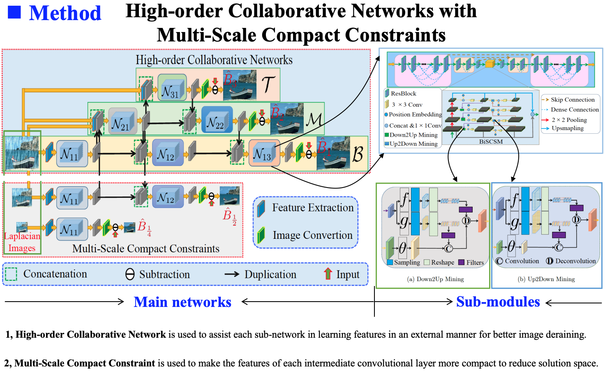
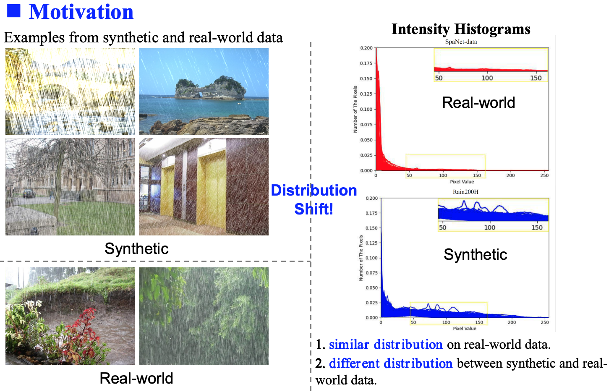
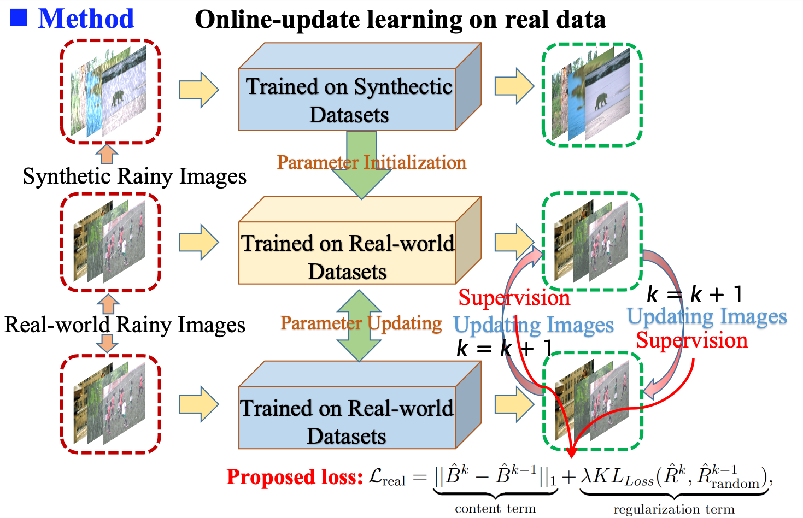
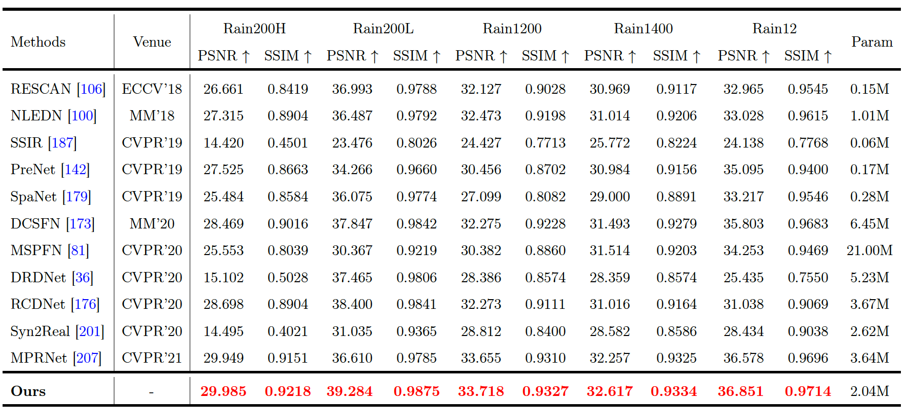
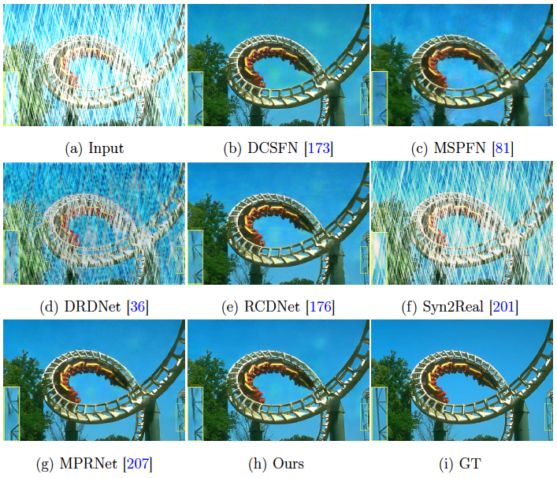
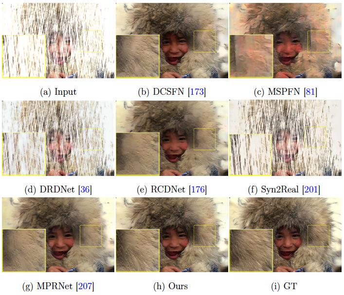
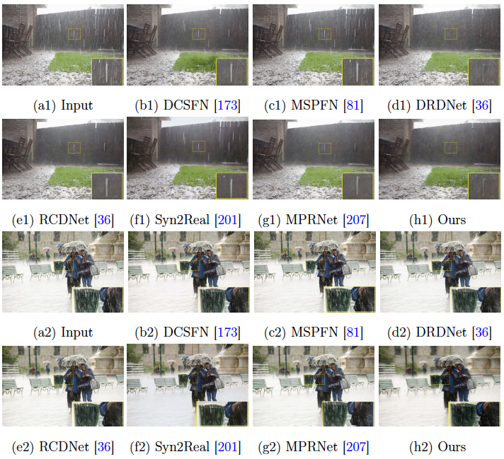
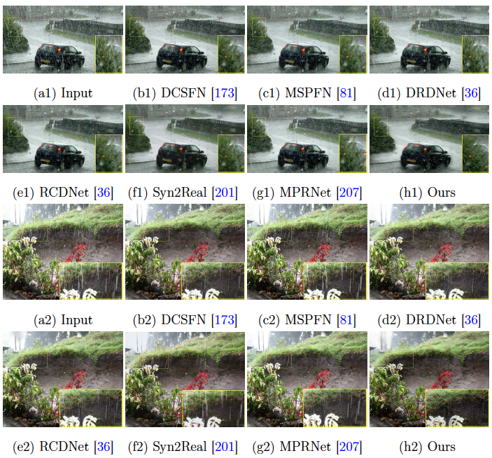
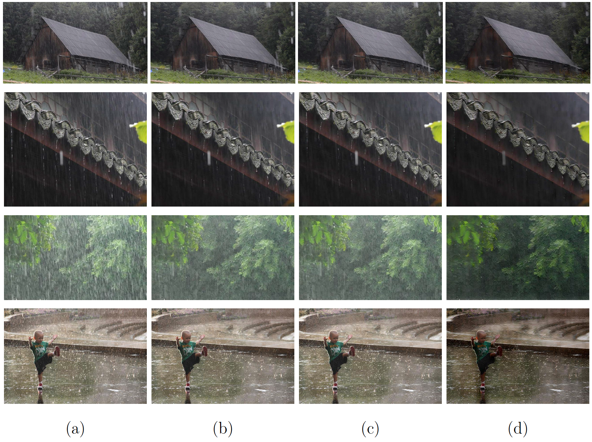

# Online-Updated High-Order Collaborative Networks for Single Image Deraining [AAAI-22]

This is the official PyTorch codes for the paper  
[Online-Updated High-Order Collaborative Networks for Single Image Deraining](https://ojs.aaai.org/index.php/AAAI/article/view/20140)

[Cong Wang](https://scholar.google.com/citations?user=0DrHHRwAAAAJ&hl=zh-CN), [Jinshan Pan](https://jspan.github.io/), [Xiao-Ming Wu](https://www4.comp.polyu.edu.hk/~csxmwu/)

## Abstract
```
Single image deraining is an important and challenging task for some downstream artificial intelligence applications such as video surveillance and self-driving systems.
Most of the existing deep-learning-based methods constrain the network to generate derained images but few of them explore features from intermediate layers, different levels, and different modules which are beneficial for rain streaks removal.
In this paper, we propose a high-order collaborative network with multi-scale compact constraints and a bidirectional scale-content similarity mining module to exploit features from deep networks externally and internally for rain streaks removal.
Externally, we design a deraining framework with three sub-networks trained in a collaborative manner, where the bottom network transmits intermediate features to the middle network which also receives shallower rainy features from the top network and sends back features to the bottom network.
Internally, we enforce multi-scale compact constraints on the intermediate layers of deep networks to learn useful features via a Laplacian pyramid.
Further, we develop a bidirectional scale-content similarity mining module to explore features at different scales in a down-to-up and up-to-down manner.
To improve the model performance on real-world images, we propose an online-update learning approach, which uses real-world rainy images to fine-tune the network and update the deraining results in a self-supervised manner.
Extensive experiments demonstrate that our proposed method performs favorably against eleven state-of-the-art methods on five public synthetic datasets and one real-world dataset.
```

## Overall of our approach on synthetic dataset




## Motivation on real-world data
```
There exists significant patch recurrence property of a rainy image, that is, similar patches tend to recur many times in one image and its multi-scale images and external images.
```



## Online-updated learning on real-world images


## Results on synthetic data




## Results on real data



### Effectiveness of online-updated learning

Ablation study of the proposed online-update learning approach. (a) Input. (b) Only trained on synthetic data. (c) Directly fine-tuned on real-world  images. (d) Online-update learning on real-world images.

## Installment dependency

1 Create conda environment.
```
conda create --name supercong
conda activate supercong
conda install pytorch=1.1.0 torchvision=0.3.0 cudatoolkit=9.0 -c pytorch
```
2 Install other dependencies.
```
pip install -r requirements.txt
```

## Datasets Download

[Rain200H\&Rain200L](https://www.icst.pku.edu.cn/struct/Projects/joint_rain_removal.html), [Rain800](https://github.com/hezhangsprinter/ID-CGAN), [Rain1200](https://github.com/hezhangsprinter/DID-MDN), [Rain1400](https://xueyangfu.github.io/projects/cvpr2017.html)

[Real-world dataset](https://drive.google.com/drive/folders/1KfEmQbEtGujk_4j4bmfs5Z9ffN6kwEAZ?usp=sharing)

### Train on synthetic data 

```
bash python train.py
```

### Train on real-world data 

```
bash python ral_train.py
```

### Test

```
bash python eval.py
```

### Show

```
bash python show.py
```


## Citation
```
@inproceedings{wang2024msgnn,
      author={Cong Wang and Jinshan Pan and Xiao-Ming Wu},
      title={Online-updated High-order Collaborative Networks for Image Deraining}, 
      year={2022},
      Journal = {Proceedings of the AAAI Conference on Artificial Intelligence (AAAI)},
}
```

## License

<a rel="license" href="http://creativecommons.org/licenses/by-nc-sa/4.0/"></a><br />This work is licensed under a <a rel="license" href="http://creativecommons.org/licenses/by-nc-sa/4.0/">Creative Commons Attribution-NonCommercial-ShareAlike 4.0 International License</a>.

## Contact

Any questions can contact: Cong Wang [supercong94@gmail.com]

## Our other deraining works

ACM MM-2020: [Dcsfn: Deep cross-scale fusion network for single image rain removal](https://github.com/supersupercong/DCSFN)

ACM MM-2020: [Joint self-attention and scale-aggregation for self-calibrated deraining network](https://github.com/Ohraincu/JDNet)

IJCAI-2024: [Explore Internal and External Similarity for Single Image Deraining with Graph Neural Networks](https://github.com/supersupercong/MSGNN)

IEEE TCSVT-2022: [Semi-supervised image deraining using knowledge distillation](https://github.com/cuiyixin555/SSID-KD)

IEEE ICME-2020: [Physical model guided deep image deraining](https://github.com/Ohraincu/PHYSICAL-MODEL-GUIDED-DEEP-IMAGE-DERAINING)

